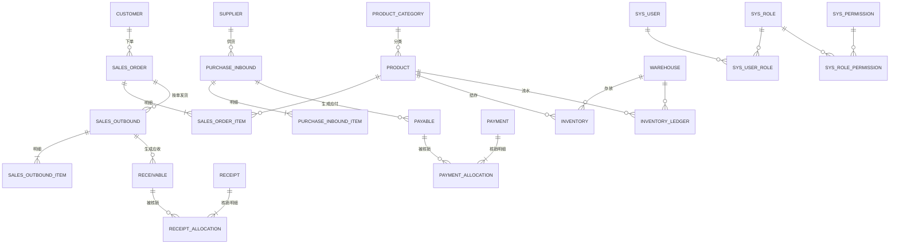

# 数据库设计(一期)

| 项 | 内容 |
|---|---|
| 版本 | v0.1(草案) |
| 日期 | 2026-08-31 |
| 依据 | [requirements.md](requirements.md) v0.1 |
| 说明 | 类型以 SQL Server(T-SQL)为准;仅覆盖一期 P0/P1,P2 扩展在文末说明 |

---

## 1. 设计约定

### 1.1 通用字段(所有表默认携带,下文表结构中不再重复)

| 列 | 类型 | 说明 |
|---|---|---|
| id | BIGINT UNSIGNED PK AUTO_INCREMENT | 主键 |
| created_by / created_at | BIGINT / DATETIME | 创建人 / 创建时间 |
| updated_by / updated_at | BIGINT / DATETIME | 更新人 / 更新时间 |

### 1.2 删除与状态策略

- **档案表**(商品/客户/供应商/仓库):`is_active` 停用标记,不物理删除。
- **单据表**:不物理删除,用 `status` 表达生命周期:`DRAFT` 草稿 → `AUDITED` 已审核 → `VOID` 已作废;错误更正走红冲单据(`reversed_doc_id` 关联)。
- **应收/应付**:`UNSETTLED` 未核销 → `PARTIAL` 部分核销 → `SETTLED` 已核销。

### 1.3 精度与编号

- 数量 `DECIMAL(18,4)`;单价/金额 `DECIMAL(18,2)`;计算过程用 DECIMAL,禁止浮点。
- 业务日期 `biz_date DATE`(影响账期与报表)与录入时间 `created_at` 分离。
- 单据号由 `doc_sequence` 表按 `类型+日期` 生成(如 `SO20260831-0001`),全库唯一。

### 1.4 单据通用模式

所有业务单据 = **主表 + 明细表**,主表含:`doc_no`、`status`、`biz_date`、`audit_by`、`audit_at`、`remark`;明细表含:`line_no` 行号、`product_id`、`qty`、`price`、`amount`(= qty × price,落库冗余)、`note`。

### 1.5 SQL Server 实现说明

| 通用设计 | SQL Server 落地方式 |
|---|---|
| 主键 | `BIGINT IDENTITY(1,1)`,实体用 `IdType.AUTO` |
| 文本列 | `NVARCHAR`(库排序规则 `Chinese_PRC_CI_AS`,中文不乱码) |
| 列注释 | DDL 行内 `--` 注释(SQL Server 无列内 COMMENT) |
| JSON 字段(operation_log.detail) | `NVARCHAR(MAX)` 存 JSON 文本 |
| `updated_at` 自动更新 | 无 `ON UPDATE CURRENT_TIMESTAMP`,由 `AuditMetaHandler` + `@TableField(fill)` 应用层填充 |
| 无符号整型 | 无,统一 `BIGINT` / `INT` |

---

## 2. ER 总图



> 明细表的连线省略了 PRODUCT / WAREHOUSE 外键(所有明细均含 `product_id`,出入库类明细含 `warehouse_id`)。

---

## 3. 表结构

### 3.1 基础数据

#### product_category 商品分类

| 列 | 类型 | 说明 |
|---|---|---|
| parent_id | BIGINT | 上级分类,0 = 根 |
| name | VARCHAR(50) | 名称 |
| sort | INT | 排序 |
| is_active | TINYINT | 1 启用 / 0 停用 |

#### product 商品

| 列 | 类型 | 说明 |
|---|---|---|
| code | VARCHAR(30) **UNIQUE** | 商品编码,按规则自动生成 |
| category_id | BIGINT | 分类 |
| name | VARCHAR(100) | 名称 |
| spec | VARCHAR(100) | 规格型号 |
| unit | VARCHAR(20) | 基本单位(P2 多单位换算再扩展) |
| barcode | VARCHAR(50) | 条码,可空,UNIQUE(允许空重复) |
| purchase_price | DECIMAL(18,2) | 默认进价(开采购单带出,可改) |
| sale_price | DECIMAL(18,2) | 默认售价 |
| min_sale_price | DECIMAL(18,2) | 最低限价(订单审核强制校验,US-403) |
| is_active | TINYINT | 停用后不可新开单,历史单据正常 |

#### customer 客户

| 列 | 类型 | 说明 |
|---|---|---|
| code | VARCHAR(30) **UNIQUE** | 客户编码 |
| name | VARCHAR(100) | 名称(全称),UNIQUE |
| short_name | VARCHAR(50) | 简称(搜索用) |
| contact / phone | VARCHAR(50) / VARCHAR(20) | 联系人 / 电话 |
| address | VARCHAR(200) | 默认收货地址 |
| payment_term_days | INT | 账期(天),应收到期日 = biz_date + 账期 |
| credit_limit | DECIMAL(18,2) | 信用额度,0 = 不限 |
| salesperson_id | BIGINT | **归属业务员 → 数据权限锚点(US-601)** |
| is_active | TINYINT | |

#### supplier 供应商

| 列 | 类型 | 说明 |
|---|---|---|
| code / name | VARCHAR(30) **UNIQUE** / VARCHAR(100) | 编码 / 名称(UNIQUE) |
| contact / phone | VARCHAR(50) / VARCHAR(20) | |
| payment_term_days | INT | 账期 |
| settle_type | VARCHAR(10) | 结算方式:现结 / 月结 … |
| bank_name / bank_account | VARCHAR(100) / VARCHAR(50) | 开户行 / 账号 |
| is_active | TINYINT | |

#### warehouse 仓库

| 列 | 类型 | 说明 |
|---|---|---|
| code / name | VARCHAR(30) **UNIQUE** / VARCHAR(50) | 编码 / 名称 |
| type | VARCHAR(10) | 正品仓 / 次品仓 / 样品仓 |
| is_active | TINYINT | |

### 3.2 库存

#### inventory 即时库存(结存表)

| 列 | 类型 | 说明 |
|---|---|---|
| product_id + warehouse_id | **UNIQUE** 联合键 | 每商品每仓一行 |
| qty | DECIMAL(18,4) | 当前结存数量 |
| total_cost | DECIMAL(18,2) | 结存总成本;**加权平均成本 = total_cost / qty** |
| version | INT | 乐观锁,配合原子扣减(见 §6) |

#### inventory_ledger 出入库流水(台账,只增不改)

| 列 | 类型 | 说明 |
|---|---|---|
| doc_type | VARCHAR(20) | PURCHASE_IN / SALES_OUT / TRANSFER / CHECK_ADJ / OTHER_IN / OTHER_OUT / SALES_RETURN / PURCHASE_RETURN |
| doc_id / doc_no | BIGINT / VARCHAR(30) | 来源单据,可反查 |
| product_id / warehouse_id | BIGINT | |
| direction | TINYINT | 1 入库 / -1 出库 |
| qty | DECIMAL(18,4) | 变动数量(正数,方向由 direction 表达) |
| unit_cost / amount | DECIMAL(18,2) | 出入库成本单价 / 金额 |
| balance_qty / balance_amount | DECIMAL | **变动后**结存数量 / 金额(快照,审计追溯用) |
| biz_date | DATE | 业务日期 |

### 3.3 销售

#### sales_order 销售订单(主)

| 列 | 类型 | 说明 |
|---|---|---|
| doc_no | VARCHAR(30) **UNIQUE** | `SOyyyyMMdd-nnnn` |
| customer_id | BIGINT | 客户 |
| salesperson_id | BIGINT | 业务员(数据权限) |
| status | VARCHAR(10) | DRAFT / AUDITED / VOID |
| ship_status | VARCHAR(10) | UN_SHIPPED 待发货 / PART_SHIPPED 部分发货 / SHIPPED 已发货 |
| total_amount | DECIMAL(18,2) | 订单总额(冗余汇总) |
| audit_by / audit_at | | 审核人 / 审核时间 |

#### sales_order_item(明细)

| 列 | 类型 | 说明 |
|---|---|---|
| order_id / line_no | BIGINT / INT | 主表 / 行号 |
| product_id | BIGINT | |
| qty | DECIMAL(18,4) | 订货数量 |
| shipped_qty | DECIMAL(18,4) | 已发数量(冗余,出库审核时事务性累加;部分发货判断依据) |
| price / amount | DECIMAL(18,2) | 售价 / 金额 |

#### sales_outbound 销售出库单(主)

| 列 | 类型 | 说明 |
|---|---|---|
| doc_no | **UNIQUE** | `OUTyyyyMMdd-nnnn` |
| order_id | BIGINT | 来源销售订单 |
| customer_id / warehouse_id | BIGINT | 冗余客户;发货仓 |
| status | VARCHAR(10) | DRAFT / AUDITED / VOID |

#### sales_outbound_item(明细)

| 列 | 类型 | 说明 |
|---|---|---|
| outbound_id / line_no | | |
| order_item_id | BIGINT | 对应订单明细行(发货跟踪) |
| product_id / warehouse_id | BIGINT | |
| qty | DECIMAL(18,4) | 实发数量(可 < 订货数量,部分发货) |
| price / amount | DECIMAL(18,2) | 取订单售价(不可改价,改价回订单改) |
| cost_price / cost_amount | DECIMAL(18,2) | **审核时**按加权平均结转的成本(快照) |

#### receivable 应收账款(由出库单自动生成)

| 列 | 类型 | 说明 |
|---|---|---|
| customer_id | BIGINT | |
| doc_type | VARCHAR(20) | SALES_OUT / SALES_RETURN(退货生成负应收或红字记录) |
| doc_id / doc_no | | 来源出库单 |
| biz_date / due_date | DATE | 业务日期 / 到期日(= biz_date + 客户账期) |
| amount | DECIMAL(18,2) | 应收金额 |
| received_amount | DECIMAL(18,2) | 已核销金额(收款时事务性累加) |
| status | VARCHAR(10) | UNSETTLED / PARTIAL / SETTLED |

#### receipt 收款单(主)

| 列 | 类型 | 说明 |
|---|---|---|
| doc_no | **UNIQUE** | `RCVyyyyMMdd-nnnn` |
| customer_id | BIGINT | |
| amount | DECIMAL(18,2) | 本次收款总额 |
| method | VARCHAR(10) | 转账 / 现金 / 承兑 … |
| bank_account | VARCHAR(50) | 收款账户 |
| status | VARCHAR(10) | DRAFT / AUDITED / VOID |

#### receipt_allocation 核销明细

| 列 | 类型 | 说明 |
|---|---|---|
| receipt_id | BIGINT | 收款单 |
| receivable_id | BIGINT | 被核销的应收 |
| amount | DECIMAL(18,2) | 本次核销金额 |

> **核销规则**:同一收款单各核销行金额之和 ≤ 收款总额;差额即**预收款**(暂挂客户,后续可再建核销行冲抵,一期不做预收冲抵界面,仅余额查询)。

### 3.4 采购(简化版)

#### purchase_inbound 采购入库单(主)

| 列 | 类型 | 说明 |
|---|---|---|
| doc_no | **UNIQUE** | `PINyyyyMMdd-nnnn` |
| supplier_id / warehouse_id | BIGINT | 供应商 / 入库仓 |
| status | VARCHAR(10) | DRAFT / AUDITED / VOID |

#### purchase_inbound_item(明细)

| 列 | 类型 | 说明 |
|---|---|---|
| inbound_id / line_no | | |
| product_id / warehouse_id | BIGINT | |
| qty | DECIMAL(18,4) | 入库数量 |
| price / amount | DECIMAL(18,2) | 进价 / 金额(即采购成本) |

#### payable 应付账款(入库审核自动生成)

结构与 receivable 对称:`supplier_id`、`doc_type/doc_id/doc_no`、`biz_date/due_date`、`amount`、`paid_amount`、`status`。

#### payment / payment_allocation 付款单及核销

结构与 receipt / receipt_allocation 对称:付款单号 `PAYyyyyMMdd-nnnn`、`method`、`bank_account`;核销表指向 payable。

### 3.5 系统管理

#### sys_user 用户

| 列 | 类型 | 说明 |
|---|---|---|
| username | VARCHAR(30) **UNIQUE** | 登录名 |
| password_hash | VARCHAR(100) | 哈希存储(bcrypt/argon2),禁明文 |
| real_name | VARCHAR(50) | 姓名 |
| is_active | TINYINT | 禁用后无法登录 |

#### sys_role / sys_permission / 关联表

| 表 | 关键列 | 说明 |
|---|---|---|
| sys_role | code, name | 固定四角色:ADMIN / SALES / WAREHOUSE / FINANCE |
| sys_permission | code, name, type(MENU/BUTTON), parent_id | 菜单与按钮权限点,如 `sales:order:audit` |
| sys_user_role | user_id, role_id | UNIQUE(user_id, role_id) |
| sys_role_permission | role_id, permission_id | UNIQUE(role_id, permission_id) |

> **数据权限不入权限表**,按 §1 的锚点实现:`customer.salesperson_id`、`sales_order.salesperson_id`、`receivable.customer_id` → 业务员查询自动追加 `salesperson_id = 当前用户`;仓管查询排除成本/毛利字段(字段级控制,见 requirements.md §3)。

#### operation_log 操作日志(只增不改)

| 列 | 类型 | 说明 |
|---|---|---|
| user_id / user_name | | 操作人快照 |
| module / action | VARCHAR(30) | 如 `sales_order` / `AUDIT`、`PRICE_CHANGE`、`VOID` |
| doc_type / doc_id / doc_no | | 目标单据 |
| detail | JSON | 变更前后关键值(尤其价格、数量) |
| ip | VARCHAR(45) | |

#### doc_sequence 单据编号序列

| 列 | 类型 | 说明 |
|---|---|---|
| doc_type + period | **UNIQUE** 联合键 | 如 `SO` + `20260831` |
| next_no | INT | 事务内原子自增(见 §6) |

---

## 4. P1 扩展表(模式预告,一期不展开)

均遵循「主表 + 明细 + 审核后写 inventory_ledger」的统一模式:

| 表 | 要点 |
|---|---|
| sales_return(_item) 销售退货 | 关联原出库单;审核后库存 +,应收红冲 |
| purchase_return(_item) 采购退货 | 关联原入库单;审核后库存 −,应付红冲 |
| stock_transfer(_item) 调拨 | 转出仓 − / 转入仓 +,成本随货转移 |
| stock_take(_item) 盘点 | 实盘数 vs 账面数 → 生成 CHECK_ADJ 调整单 |
| other_stock_doc(_item) 其他出入库 | 类型字典:样品领用 / 报损 / 受赠等 |

P2 预留:商品多单位换算表 `product_unit_conv`、客户专属价 `customer_price`、批次表 `inventory_batch`。

---

## 5. 索引要点

| 表 | 索引 | 用途 |
|---|---|---|
| inventory_ledger | (product_id, warehouse_id, biz_date)、(doc_type, doc_id) | 商品流水查询 / 单据反查 |
| sales_order | (salesperson_id, biz_date)、(customer_id) | 业务员数据权限过滤 / 客户查询 |
| receivable | (customer_id, status)、(due_date) | 账龄分析、到期提醒 |
| inventory_ledger | (biz_date) | 日报/月报 |
| 所有单据主表 | doc_no 已 UNIQUE;(status, biz_date) | 待办列表过滤 |

---

## 6. 并发与事务要点(开发红线)

### 6.1 原子扣库存(防超卖)

```sql
UPDATE inventory
SET qty = qty - :qty,
    total_cost = total_cost - :qty * :avg_cost,
    version = version + 1
WHERE product_id = :pid AND warehouse_id = :wid
  AND qty >= :qty;
-- 受影响行数 = 0 → 库存不足,整个事务回滚(对应验收标准:整体回滚无脏数据)
```

### 6.2 出库审核 = 单一大事务

同一事务内完成:① 扣 inventory → ② 写 inventory_ledger → ③ 写 sales_outbound_item.cost_* → ④ 累加 sales_order_item.shipped_qty 并更新主表 ship_status → ⑤ 生成 receivable → ⑥ 写 operation_log。任一步失败全部回滚。

### 6.3 移动加权平均

```
入库:新加权成本 = (结存金额 + 本次入库金额) / (结存数量 + 本次入库数量)
出库:结转成本 = 出库数量 × 当前加权成本(出库不改变加权成本)
```

### 6.4 单据编号

`UPDATE doc_sequence SET next_no = next_no + 1 WHERE doc_type=:t AND period=:p` 后读回,行锁保证并发不重号;号段作废不回收。

---

## 7. 需求 → 表 映射速查

| 需求编号 | 主要表 |
|---|---|
| F101–F105 基础档案 | product(_category)、customer、supplier、warehouse |
| F201–F202 采购简化 | purchase_inbound(_item)、payable、payment(_allocation) |
| F301–F303 库存 | inventory、inventory_ledger |
| F401–F406 销售 | sales_order(_item)、sales_outbound(_item)、receivable、receipt(_allocation) |
| F501–F505 报表 | 基于 inventory_ledger + 单据表聚合,不另建表 |
| F601–F603 系统 | sys_user / sys_role / sys_permission / sys_user_role / sys_role_permission、operation_log、doc_sequence |

> 一期物理表合计约 **24 张**(含主子表与关联表),核心业务链路 12 张:product、customer、supplier、warehouse、inventory、inventory_ledger、sales_order(_item)、sales_outbound(_item)、receivable、receipt(_allocation)、purchase_inbound(_item)、payable、payment(_allocation)。
