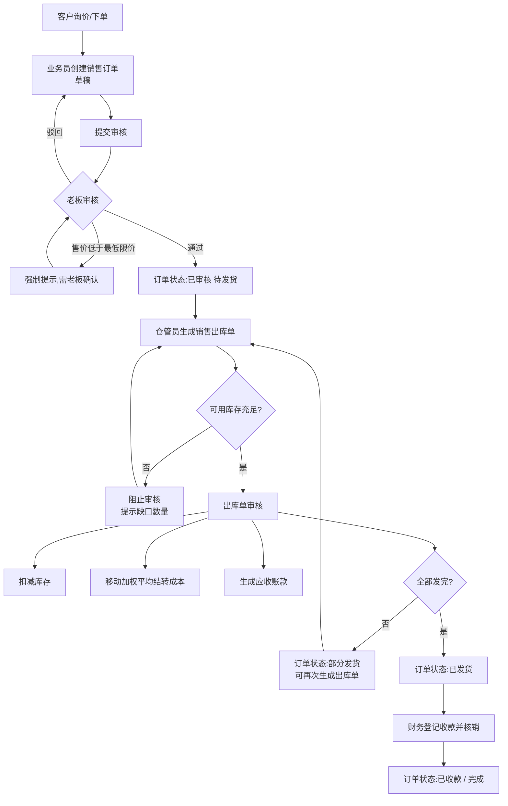
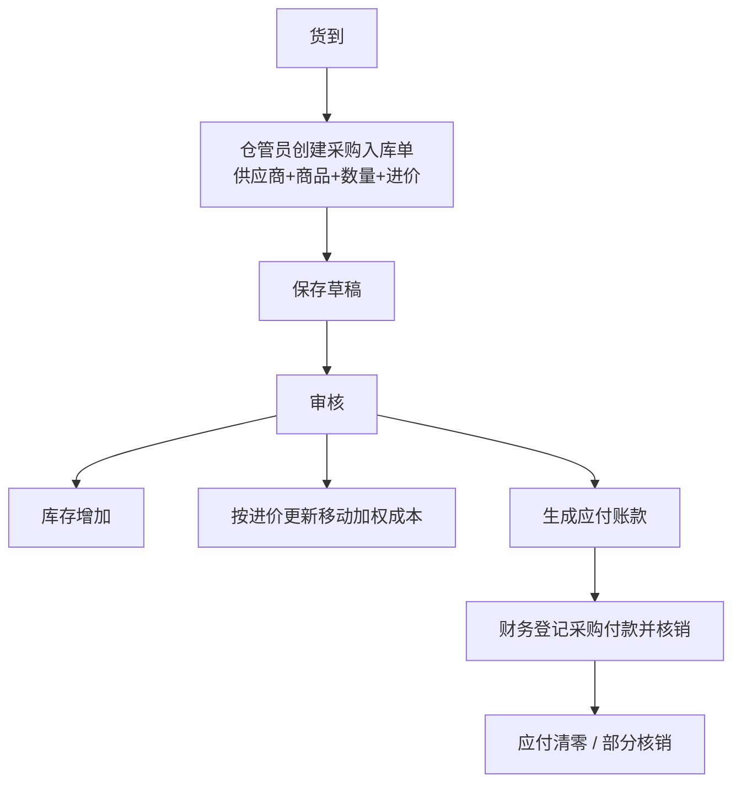
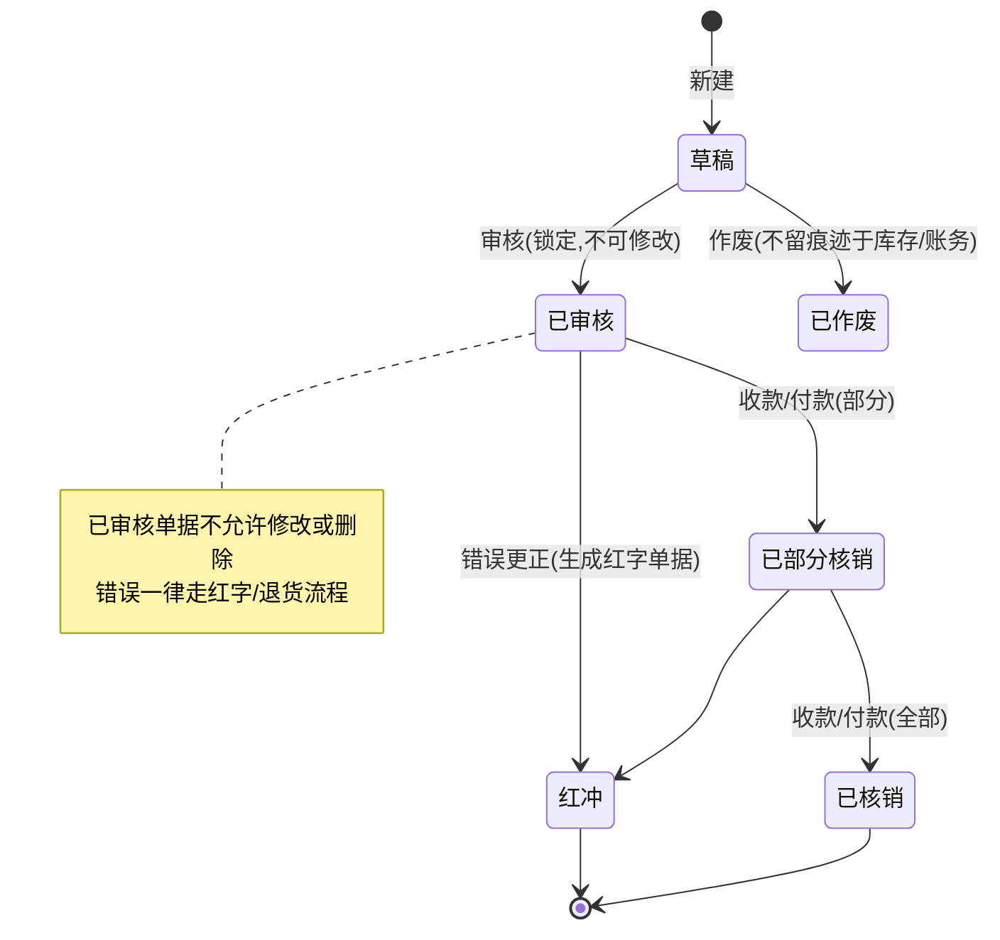

# 小型贸易公司 ERP — 需求文档(一期)

| 项 | 内容 |
|---|---|
| 版本 | v0.1(草案) |
| 日期 | 2026-08-31 |
| 一期范围 | 基础数据 + 简化采购(仅入库/付款)+ 库存 + 销售(订单/出库/应收/收款)+ 基础报表 + 权限 |
| 二期范围 | 报价单、退货增强、调拨盘点增强、信用额度控制、毛利报表增强、打印模板、批次效期 |
| 三期范围 | 外贸单证、电商对接、审批流、BI 看板 |

> 注:流程图使用 Mermaid 语法。VS Code 内置预览不渲染 Mermaid,请安装扩展 **Markdown Preview Mermaid Support**,或在 GitHub/GitLab 上查看。

---

## 1. 角色定义

| 角色 | 说明 | 小公司典型对应 |
|---|---|---|
| 老板(Admin) | 全部权限:审核、查看所有数据与报表、系统管理 | 老板本人 |
| 销售业务员 | 开销售订单、跟进客户;**仅能访问本人客户及本人单据** | 业务员 |
| 仓管员 | 出入库、盘点、调拨;看数量不看成本 | 仓库文员 |
| 财务 | 收付款、核销、对账(极小公司常由老板兼任) | 会计 |

---

## 2. 功能列表

优先级:P0 = 一期必须有;P1 = 一期争取;P2 = 延后至二期及以后。

### 2.1 基础数据(EP1)

| 编号 | 功能点 | 说明 | 优先级 | 用户故事 |
|---|---|---|---|---|
| F101 | 商品档案 | 编码自动生成、名称、规格、单位、分类、进价、售价、图片附件、停启用 | P0 | US-101 |
| F102 | 商品分类 | 分类树管理 | P0 | US-102 |
| F103 | 客户档案 | 联系人、账期、信用额度、收货地址、停启用 | P0 | US-103 |
| F104 | 供应商档案 | 联系人、账期、结算方式、开户行 | P0 | US-104 |
| F105 | 仓库定义 | 多仓库:正品仓 / 次品仓 / 样品仓 | P0 | US-105 |
| F106 | 期初建账 | Excel 导入商品、客户、供应商、期初库存 | P1 | US-106 |
| F107 | 停用机制 | 档案只停用不删除,历史单据保留可查 | P1 | US-107 |
| F108 | 客户专属价 | 按客户设置专属售价 | P2 | US-108 |

### 2.2 采购 — 简化版(EP2)

| 编号 | 功能点 | 说明 | 优先级 | 用户故事 |
|---|---|---|---|---|
| F201 | 采购入库单 | 选供应商 + 商品 + 数量 + 进价;审核后入库并生成应付 | P0 | US-201 |
| F202 | 采购付款 | 付款登记并核销入库单 | P0 | US-202 |
| F203 | 采购退货 | 退供应商出库,冲减应付 | P1 | US-203 |
| F204 | 应付查询 | 应付明细 + 账龄 | P1 | US-204 |
| F205 | 完整采购管理 | 采购订单 PO、到货跟踪、部分收货、费用分摊、暂估 | **P2(二期)** | — |

### 2.3 库存(EP3)

| 编号 | 功能点 | 说明 | 优先级 | 用户故事 |
|---|---|---|---|---|
| F301 | 即时库存 | 按仓库/商品/分类查询数量与成本金额 | P0 | US-301 |
| F302 | 出入库流水 | 全部库存变动台账,可反查单据与操作人 | P0 | US-302 |
| F303 | 移动加权平均成本 | 出库自动结转成本 | P0 | US-306 |
| F304 | 调拨单 | 仓间调拨 | P1 | US-303 |
| F305 | 盘点单 | 录入实盘数,自动生成盈亏调整单 | P1 | US-304 |
| F306 | 其他出入库 | 样品领用、报损等 | P1 | US-305 |
| F307 | 批次/效期 | 先进先出、效期预警 | P2(二期) | — |

### 2.4 销售(EP4)

| 编号 | 功能点 | 说明 | 优先级 | 用户故事 |
|---|---|---|---|---|
| F401 | 销售订单 | 选客户、商品、数量售价;校验最低限价与信用额度 | P0 | US-401 |
| F402 | 订单跟踪 | 状态:草稿→待审核→已审核→部分发货→已发货→已收款 | P0 | US-402 |
| F403 | 订单审核 | 老板审核;低于最低限价强制提示 | P0 | US-403 |
| F404 | 销售出库单 | 按订单生成,支持部分发货;审核后扣库存、结转成本、生成应收 | P0 | US-404 |
| F405 | 销售退货 | 退货入库,冲减收入/应收/成本 | P1 | US-405 |
| F406 | 收款核销 | 收款登记,一次核销多单,支持预收款 | P0 | US-406 |
| F407 | 客户对账单 | 按客户输出对账单,可打印/导出 | P1 | US-407 |
| F408 | 送货单打印 | 按模板打印 | P1 | US-408 |

### 2.5 报表(EP5)

| 编号 | 功能点 | 说明 | 优先级 | 用户故事 |
|---|---|---|---|---|
| F501 | 销售日报/月报 | 销售额、毛利;按客户/业务员/商品维度 | P0 | US-501 |
| F502 | 应收账龄表 | 30/60/90 天分段 | P0 | US-502 |
| F503 | 进销存汇总表 | 期初 + 入库 − 出库 = 期末 | P1 | US-503 |
| F504 | 业务员业绩排行 | 销售额、毛利贡献 | P1 | US-504 |
| F505 | 导出 Excel | 所有列表与报表一键导出 | P0 | US-505 |

### 2.6 系统管理(EP6)

| 编号 | 功能点 | 说明 | 优先级 | 用户故事 |
|---|---|---|---|---|
| F601 | 用户/角色/权限 | 菜单权限 + 数据权限(业务员仅本人数据) | P0 | US-601 |
| F602 | 单据自动编号 | 规则如 `SO20260831-0001` | P0 | US-602 |
| F603 | 操作日志 | 关键操作留痕:改价、作废、审核 | P0 | US-603 |
| F604 | 数据备份 | 一键备份/导出 | P1 | US-604 |

---

## 3. 角色权限矩阵

图例:**●** 可操作(全部数据) **◑** 可操作(仅本人或本人客户数据) **○** 只读 **✕** 无权限

| 功能 | 老板 | 销售业务员 | 仓管员 | 财务 |
|---|:-:|:-:|:-:|:-:|
| 商品 / 仓库档案 | ● | ○ | ○ | ○ |
| 客户档案 | ● | ◑ | ○ | ○ |
| 供应商档案 | ● | ✕ | ○ | ○ |
| 采购入库单 | ● | ✕ | ● | ○ |
| 采购付款 | ● | ✕ | ✕ | ● |
| 销售订单(新建/修改) | ● | ◑ | ○ | ○ |
| 订单审核 | ● | ✕ | ✕ | ✕ |
| 销售出库单 | ● | ✕ | ● | ○ |
| 销售退货 | ● | ✕ | ● | ○ |
| 收款核销 | ● | ✕ | ✕ | ● |
| 即时库存 / 出入库流水 | ● | ○ | ● | ● |
| 调拨 / 盘点 / 其他出入库 | ● | ✕ | ● | ○ |
| 销售与毛利报表 | ● | ◑(仅本人业绩) | ✕ | ● |
| 应收账款 / 账龄 | ● | ◑(仅本人客户) | ✕ | ● |
| 导出 Excel | ● | ◑ | ○ | ● |
| 用户 / 权限 / 日志 / 备份 | ● | ✕ | ✕ | ✕ |

**字段级可见性规则(补充):**

| 数据字段 | 老板 | 销售业务员 | 仓管员 | 财务 |
|---|:-:|:-:|:-:|:-:|
| 成本价 / 成本金额 / 毛利 | 可见 | 不可见 | 不可见 | 可见 |
| 商品售价、订单金额 | 可见 | 可见(本人) | 不可见 | 可见 |
| 客户信用额度、应收余额 | 可见 | 可见(本人客户) | 不可见 | 可见 |

---

## 4. 业务流程草图

### 4.1 一期总体业务闭环

```
            ┌─────────────────────────────────────────────────┐
            │                    基础数据                       │
            │   商品 / 客户 / 供应商 / 仓库档案                  │
            └───────┬─────────────────────────┬───────────────┘
                    │                         │
                    ▼                         ▼
        ┌──────────────────┐       ┌──────────────────────────┐
        │  采购入库单(简化)  │       │       销售订单             │
        │  供应商+商品+数量+价 │       │  客户+商品+数量+售价        │
        └────┬────────┬────┘       └────────┬────────┬────────┘
             │        │                      │        │
       审核  │        │ 应付+          审核  │        │
             ▼        │                      ▼        │
        ┌──────────┐  │               ┌──────────┐     │
        │ 库存 增加 │  │               │ 销售出库单 │     │
        └────┬─────┘  │               └────┬─────┘     │
             │        │              审核   │           │
             │        │                    ▼           ▼
             │        │        ┌──────────┐    ┌──────────┐
             │        └───────▶│ 库存 台账 │◀───│ 应收账款 + │
             │                 │ 即时库存  │    └────┬─────┘
             │                 │ 成本核算  │         │
             │                 └────┬─────┘    收款核销
             │                      │           │
             ▼                      ▼           ▼
        ┌──────────┐        ┌────────────────────────┐
        │ 采购付款  │        │ 报表:销售/毛利/应收账龄   │
        │ 应付核销  │        │ 进销存汇总               │
        └──────────┘        └────────────────────────┘
```

### 4.2 销售主流程



### 4.3 采购入库流程(简化版)



### 4.4 退货流程


### 4.5 单据状态机(所有业务单据通用)



---

## 5. 关键业务规则

1. **库存唯一入口**:库存数量只能由已审核的业务单据(采购入库、销售出库、调拨、盘点调整、其他出入库、退货)改变,禁止任何直接改库存的操作。
2. **单据不可变**:已审核单据不允许修改或删除;录错走红字冲销或退货流程,保证审计链完整。
3. **成本核算**:采用移动加权平均法,出库时自动结转成本;入库按「数量×进价+可分摊费用」更新加权成本。
4. **单据编号**:按类型+日期自动连续编号(如 `SO20260831-0001`),不可手工修改,作废号段不回收。
5. **应收应付**:由出库/入库单自动生成,收款/付款必须核销到具体单据,不允许只挂总额。
6. **数据权限**:业务员只能访问本人客户、本人创建的订单与相关报表;仓管员不可见成本与毛利字段。
7. **审核权限**:订单审核仅老板(Admin);极小场景可在系统设置中将审核权授予财务。

---

## 6. 验收标准(贯穿所有单据类功能)

> **Given** 一张已审核的单据,**When** 任何人尝试修改或删除,**Then** 系统拒绝并提示走红字/退货流程;所有库存与应收的变动,必须能反查到唯一一张原始单据。

关键用例的细化验收(示例 — 销售出库):

| 场景 | 预期结果 |
|---|---|
| 可用库存不足时审核出库单 | 阻止审核,提示缺口数量,库存不被改动 |
| 部分发货 | 允许实发数量 < 订单数量;订单变「部分发货」;可再次生成出库单 |
| 整单审核失败(任一步骤异常) | 整体回滚:库存、成本、应收、订单状态均不变,不留脏数据 |
| 超信用额度保存订单 | 系统预警;是否阻止由系统参数决定(一期默认仅预警) |
| 出库后查询该商品流水 | 能看到本单记录,含变动前后数量与操作人 |

---

## 7. 非功能需求(一期底线)

| 类别 | 要求 |
|---|---|
| 性能 | 常用列表查询 < 2s;单据审核 < 1s;支撑 10~20 并发用户 |
| 数据安全 | 每日自动备份;导出功能受权限控制 |
| 审计 | 改价、作废、审核、权限变更全部记录操作日志 |
| 易用性 | 单据支持键盘录入、商品拼音/编码模糊搜索;表单回车跳格 |
| 兼容 | 主流浏览器(Chrome/Edge);列表与报表支持 1366×768 分辨率 |
